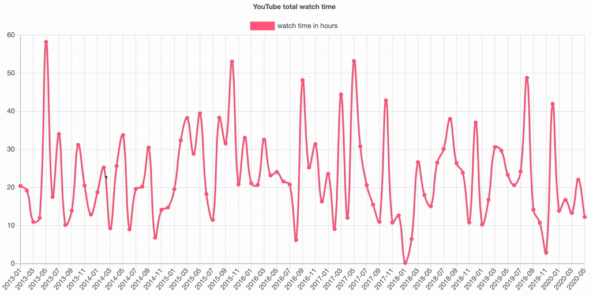

# Total YouTube watch time

This repo contains a set of scripts that will let you gain insights into how much YouTube have you watched in your life.

## How does it work?

Scripts in this repo use your Google Takeout with all of your YouTube watch history and call [YouTube Data API](https://developers.google.com/youtube/v3) to find how long those videos are. Then the scripts generate stats and chart from your watch history

## Prerequisites

### Google

- You need to have a `watch-history.json` file that you can get from your Google Takeout. Follow [this process](docs/takeout.md) to get it.

- Follow the [guide in YouTube Data API](https://developers.google.com/youtube/v3/getting-started#before-you-start) to get your API key.
  - You don't need OAuth, API key is enough.
  - The only service you need is "YouTube Data API v3"
  - **I find the [video tutorial](https://www.youtube.com/watch?v=Im69kzhpR3I) super useful**

### These scripts

- Node LTS `12.16.3` (should work on any node version 10 or higher)
- Install dependencies with `npm i`

## Usage

1. Copy your `watch-history.json` in this repository directory (root level; same as ,for example, `package.json`)
1. run `API_KEY=<your key> npm run fetch` - This will create a local JSON DB file and populates it with durations of all the videos you've ever watched. It takes 5+ minutes so you can make yourself a coffee.
1. run `npm run generate` to generate a chart (`./report.html`) which plots your watch time by month (see the leading image in this readme)
1. run `npm run stats` to generate some basic statistics about how much you watch YouTube

## Caveats

### A) Not all videos are still available

There might be a large amount of videos that are no longer available and hence the script can't fetch their duration from YouTube. Every unavailable video gets a `DEFAULT_DURATION` set to **4 minutes**. You can change this variable in `src/process.js`.

### B) There is no information about how much of the video have you watched

The scripts assumes that each video in history has been fully watched. That is not true in real life but AFAIK there isn't any better way to solve this with the data available.

There is one exception: **Maximum counted video duration is 30 minutes**. During testing I found this [NASA ISS video](https://www.youtube.com/watch?v=RtU_mdL2vBM) that is a live feed from ISS, long 532 days and counting. The `MAXIMUM_DURATION` variable can be changed in `src/process.js`

## Acknowledgements

- [Project logo](https://fontawesome.com/icons/history?style=solid) from Font Awesome
- [Charts.js](https://www.chartjs.org/)
- Npm modules: `moment`, `lodash`, `axios`, `lowdb`,`handlebars`
