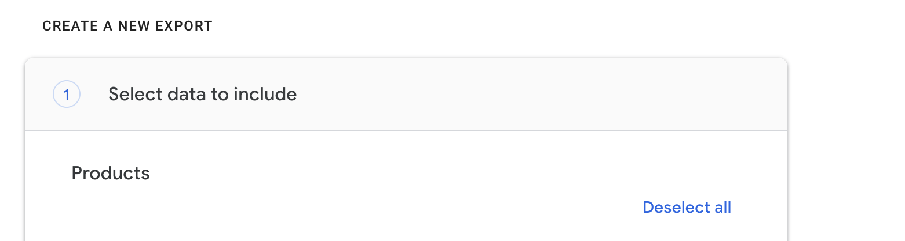
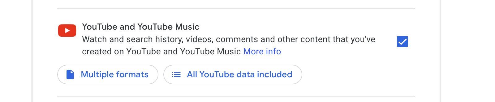
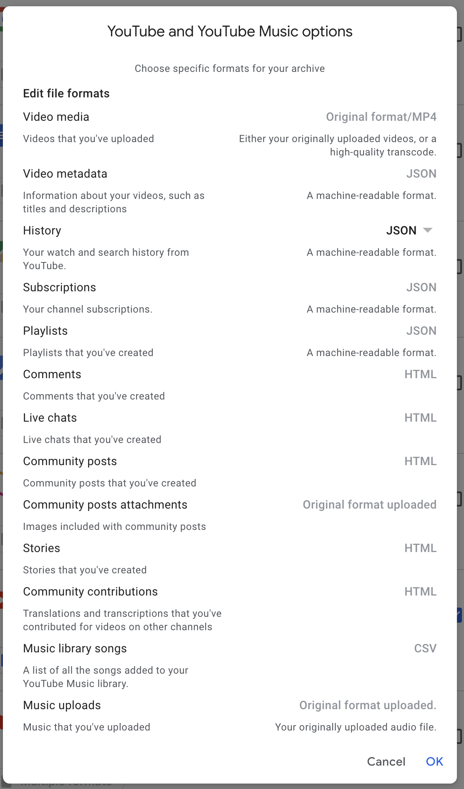
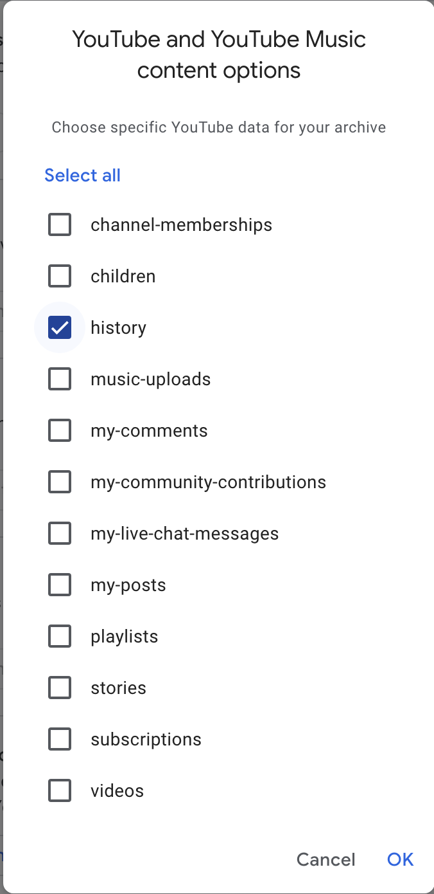
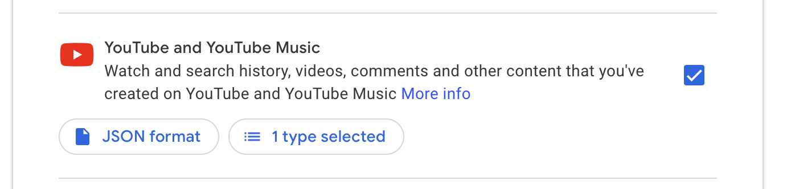

# Get your YouTube watch history from Takeout

The goal of this process is to get your `watch-history.json` file from Google Takeout. This file contains JSON containing all the YouTube videos you've ever watched including the time when you watched it.

## Initiate Takeout

1. Go to https://takeout.google.com/
1. Start by deselecting all services 
1. Then scroll to Youtube and select it to be exported 
1. Click on the "Multiple Formats" button on the YouTube item and select JSON for history **and click OK** 
1. Now click on "All YouTube data included" button and select only History: 
1. Only youtube service should be selected and it should look like this now: 
1. Go to the next step and keep the defaults:
    - Send download link via email
    - Export once
    - .zip
    - 2GB
1. Submit and wait for an email
1. Download the archive from your email link to your computer
1. After unpacking the archive, find the `watch-history.json` file in `Takeout/YouTube and YouTube Music/history/watch-history.json`
